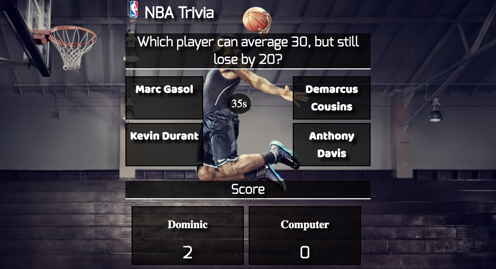
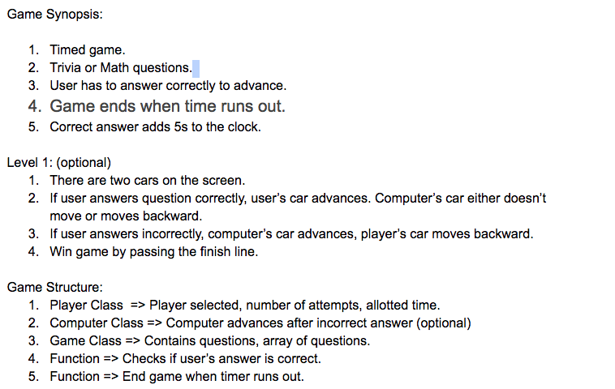

#NBA Trivia Game



###[Link to game](https://dominic-farquharson.github.io/NBA%20Trivia/)
---
##Technologies Used:
- HTML
- CSS
- Vanilla javascript
- jquery
- Velocity

---
##Installation Instructions

- Download folder.
- Double click on index.html to run the game

---
##Sample Code: Timer Function
```javascript
function counter() {
  //Interval runs every second

  let timer = setInterval(function() {
    $('#timer').html(Player1.time + 's');
    Player1.time--;
    if (Player1.time === -1) {
      // stop interval
      clearInterval(timer);
      //End game when time is up
      alert('Time is up!');
      endStartNew();
    }

  }, 1000);
}
```
---
##Build Strategy
```
CSS/HTML:
  1. Create quiz layout.
  2. Have a background image.
  3. Have locations(divs) for answer choices/ and quiz questions.
  4. Designate a player + computer score location.
JavaScript/jQuery:
  1. Create Quiz Counter.
  2. Update html with quiz answer choices and quiz question.
  3. Develop win logic.
  4. Give computer a 50% chance of getting question correct.
Velocity.js:
  1. Add transition effects to quiz questions.
```  
---
##Project Outline/Wireframe




---
##Issues/Future Goals
###Issues:
- One issue I had was with scopes. I could not access an object attribute from one of the object's methods.

###Future Goals:
- Add two cars to the screen. One to represent the player and computer.
- As each user gets a question correct, their car would advance.
- A smaller timer. Timer would increase/decrease depending on if the user's answer is correct/wrong.


---
##Special Thanks

Special thanks to my IA, Kate for providing direction as well as my fellow classmates for helping me out with any questions I had along the way.

---
##Author

Dominic Farquharson
